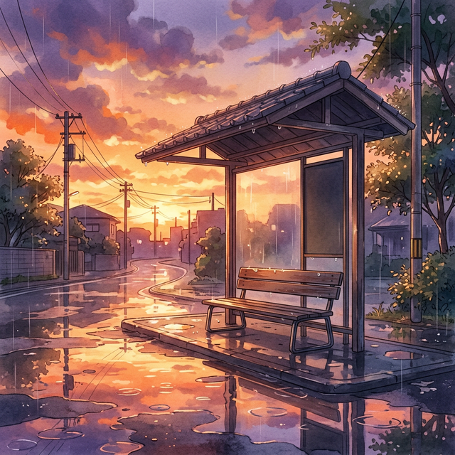

# ProReNata X投稿アイデア (2026-03-17)

> **💰 AI API消費コスト概算 (Gemini 2.0 Flash Lite)**
> - 入力トークン: 16630 (0.187円)
> - 出力トークン: 430 (0.019円)
---
「足、ダルくない？」「腰、痛くない？」って、誰かに聞かれたい日もある。でも、そんなこと、なかなか言えないこともありますよね。わたしも、同じです。だって、看護助手だもんね。今日も一日、お疲れ様でした。わたしも、足が重い。

[URL: https://prorenata.jp/posts/nursing-assistant-recommended-shoes]
---
深夜2時。ナースステーションの青白い光の中、カレンダーを見る。今日も日付が変わる。明日は休みだけど、なんだか心がざわつく。

あの人に、また会うのかな、なんて。

[Image Prompt: 病院の廊下の窓から差し込む夜の光。ナースステーションの奥で、ぼんやりと座る白崎セラ。]

---
「看護助手 底辺」って言葉、胸に刺さってしまうこともありますよね。でも、ちょっと待って。その言葉の奥にあるもの、ちゃんと見てみよう。大変なこと、たくさんあるけれど、そこからしか見えない景色も、きっとあるから。わたしも、一緒に探してみる。

[URL: https://prorenata.jp/posts/nursing-assistant-bottom-myth]
---
「辞めたい」って気持ち、抱え込んでる人、たくさんいると思う。でも、大丈夫。ひとりじゃないですよ、って。そう伝えたいです。無理せず、自分を大切にしてほしい。上手な伝え方、一緒に考えてみようよ。

[URL: https://prorenata.jp/posts/nursing-assistant-resignation-advice-insights]
---
雨上がりの夕暮れ。バス停で、隣にいた男の子が、お母さんに抱きしめられていた。その姿を見ていたら、なんだか、心の奥の方がじんわり温かくなった。いつも、ありがとうって言われるわけじゃないけれど、それでも、わたしも、がんばろうって思えた、かな。

[Image Prompt: Masterpiece, best quality, ultra-detailed 2D anime illustration, soft digital watercolor focus, emotional lighting, ProReNata style, Rainy sunset at a bus stop, orange and purple sky reflecting in puddles on the ground, a single empty bench, quiet and nostalgic atmosphere, NO people, NO text.]
