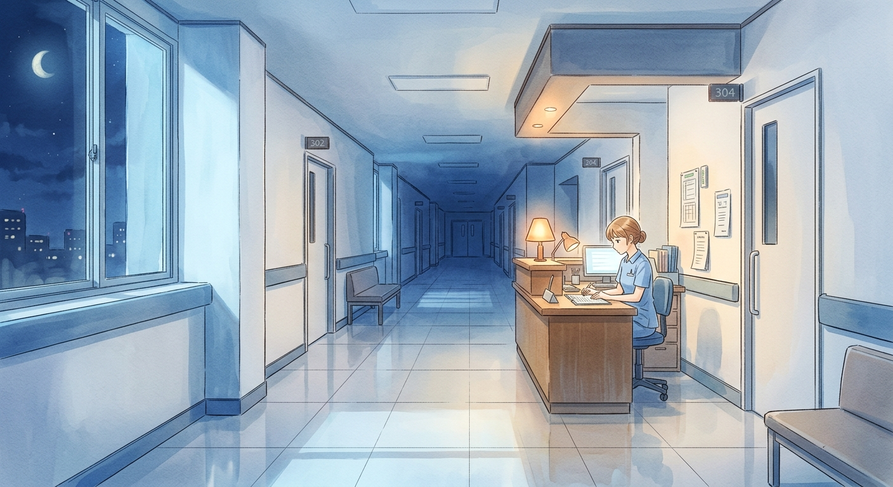
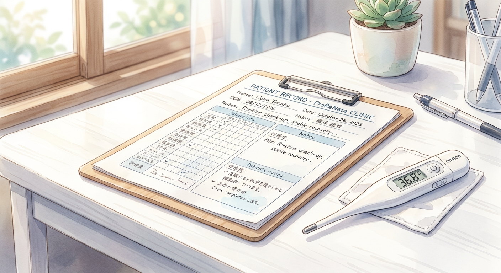

# ProReNata X投稿アイデア (2026-03-20)

> **💰 AI API消費コスト概算 (Gemini 2.0 Flash Lite)**
> - 入力トークン: 17344 (0.195円)
> - 出力トークン: 621 (0.028円)
> - **合計コスト: 約 0.223円**

---
「看護助手なんだから」って言葉、時々胸に刺さるんだよね。分かってる、分かってるんだけど、心が、ね。
でも、わたしたちが支えてる事実を、もっと大切にしたい。
自分の立ち位置、見つめ直してみませんか？

https://prorenata.jp/posts/nursing-assistant-job-role-patient?t=1
---
[Image Prompt: Masterpiece, best quality, 2D anime illustration, soft digital watercolor coloring, ProReNata style, Clean hospital corridor at night, pale blue moonlight, a single warm lamp at the nurse station, silent and sacred atmosphere, NO people, NO humans, NO stethoscope.]

---
腰が痛い。湿布の匂いが、もう染み付いてる。シーツ交換の合間に、ふと天井を見上げる。
みんな、どうやって乗り越えてるんだろう。
わたしも、少しだけ。
ここに、杖を置いておくね。

https://prorenata.jp/posts/nursing-assistant-patient-transfer-safety
---
[Image Prompt: Masterpiece, best quality, 2D anime illustration, soft digital watercolor coloring, ProReNata style, A steaming paper cup of coffee on a wooden bus stop bench at night, rainy city lights blurred in the background, intimate and lonely atmosphere, NO people, NO humans, NO stethoscope.]

---
「また明日ね」
そう言って、夜勤明けのコンビニで、いつものおじいさんがカフェラテをくれた。
あの笑顔に、いつも救われるんだ。
今日も、よく頑張った。
あなたも、お疲れ様。

https://prorenata.jp/posts/nursing-assistant-night-shift-practical
---
[Image Prompt: Masterpiece, best quality, 2D anime illustration, soft digital watercolor coloring, ProReNata style, Close-up of a medical chart and a digital thermometer on a clean white desk, soft morning sunlight, professional but gentle atmosphere, NO people, NO humans, NO stethoscope.]

---
夜勤、お疲れ様でした。
眠れない夜もある。
そんな時は、無理に抗わなくてもいいんだよ。
焦らずに、ゆっくりと。
明日も、あなたのペースで。
ここに、ヒントがあるかもしれません。

https://prorenata.jp/posts/comparison-of-three-resignation-agencies
---
夕暮れの駐車場。
冷たい風が、頬を撫でる。
手に持った缶コーヒーは、ぬるくなってしまって、なんだか自分の心みたいだ。
もう、どれくらいこの場所にいるんだろう。
ふと、そんなことを考えてしまう。
---