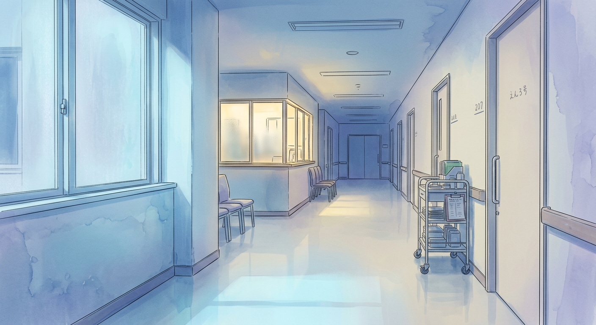
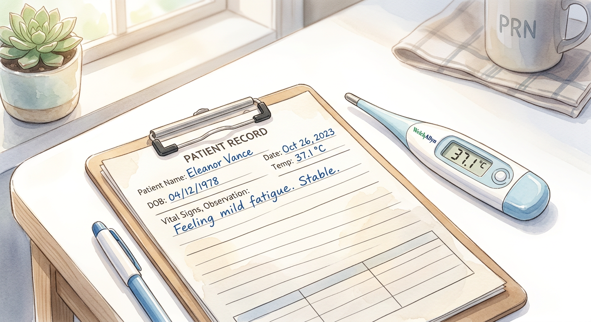

# ProReNata X投稿アイデア (2026-03-18)

> **💰 AI API消費コスト概算 (Gemini 2.0 Flash Lite)**
> - 入力トークン: 17156 (0.193円)
> - 出力トークン: 607 (0.027円)
> - **合計コスト: 約 0.220円**

---
「看護助手って、なんでこんなに腰にくるんだろう」

シーツ交換のたびに、ギシギシと音を立てる自分の体。湿布の匂いが、もう制服の一部みたいになってる。患者さんの笑顔のためって、分かってるんだけど……。「無理しないで」って、誰かに言われたい。

でも、わたしもこれで、少し景色が変わったんだ。
https://prorenata.jp/posts/nursing-assistant-job-role-patient?t=1
---
[Image Prompt: Masterpiece, best quality, 2D anime illustration, soft digital watercolor coloring, ProReNata style, Clean hospital corridor at night, pale blue moonlight, a single warm lamp at the nurse station, silent and sacred atmosphere, NO people, NO stethoscope.]

---
「あの人」がまた、来るかもしれない。

ナースステーションの青白い光は、今日もいつも通り。記録をつけながら、ふと手が止まる。また、あの人の名前がカルテに並ぶのか。

わたしもこれで、少し景色が変わったんだ。
https://prorenata.jp/posts/nursing-assistant-job-role-patient?t=1
---
夜勤明け。
疲れた体に鞭打って、朝ごはんを買いにいつものコンビニへ。店員さんが「お疲れ様です」って。
それだけで、少しだけ、心が軽くなるんだよね。

今日も一日、よく頑張った。

[Image Prompt: Masterpiece, best quality, 2D anime illustration, soft digital watercolor coloring, ProReNata style, A steaming paper cup of coffee on a wooden bus stop bench at night, rainy city lights blurred in the background, intimate and lonely atmosphere, NO people.]

---
「夜勤専従」って働き方もあるけど、実際どうなんだろう。
収入は増えるかもしれないけど、体力的にキツそうだし……。
将来への不安と、今の生活。

この記事、ちょっと参考になるかも。
https://prorenata.jp/posts/nursing-assistant-night-shift
---
[Image Prompt: Masterpiece, best quality, 2D anime illustration, soft digital watercolor coloring, ProReNata style, Close-up of a medical chart and a digital thermometer on a clean white desk, soft morning sunlight, professional but gentle atmosphere, NO people, NO stethoscope.]

---
深夜3時。
ナースステーションの隅で、マグカップを両手で包み込む。
温かいカフェオレが、少しずつ冷めていく。
「今日も、よく頑張ったね」って、誰かに言われたかった。
---